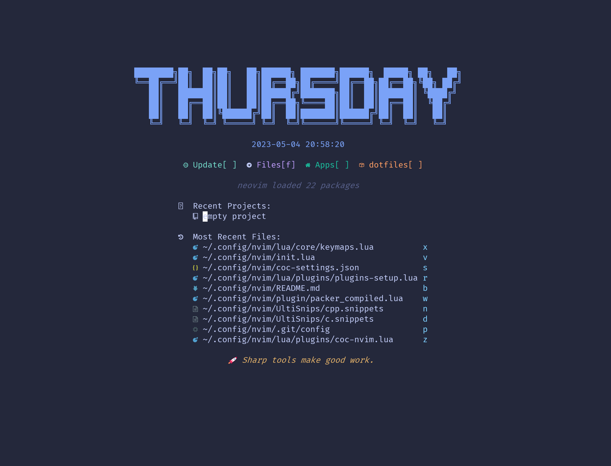

## 介绍

启动界面



目前具备功能

- 代码提示

- 文件资源管理器

- 顶部 buffer

- 底部状态栏

- 鼠标

- 代码调试

- 呼出终端

- 代码块折叠

- 启动界面

- ... ...

## 安装

#### linux

更新源

安装 python（ 3.8 3.10 … )

安装 node yarn

删除旧配置

```
rm -rf ~/.config/nvim
rm -rf ~/.cache/nvim
rm -rf ~/.local/share/nvim
```

安装

```
cd ~/.config
git clone https://github.com/rainchill/nvim.git
nvim nvim
```

打开 plugins-setup.lua 安装插件

报错 pyx command，ultisnips... 安装 `pip install pynvim`

treesitter 报错 保持 node 版本最新

保持 nvim 版本 > 0.8

`:MasonUpdate`

`:Masonc`

选择 cpptools 输入 i 安装

修改 tap/cpp.lua 的 command 目录 必须是绝对目录 不然会报错

此时全部功能配置完毕了

## 快捷键

|    按键/命令     |            说明             |
| :--------------: | :-------------------------: |
|      `gcc`       |     noremal 模式下注释      |
|       `gc`       |      visual 模式下注释      |
|  `<C-h/j/k/l>`   |          窗口移动           |
|     `<A-\>`      |        打开关闭终端         |
|     `<A-d>`      |      打开浮动关闭终端       |
| `:ToggleTerm id` |     打开标号 id 的终端      |
|       `gd`       |       跳转到代码定义        |
|     `<C-i>`      |   前往下一个文件光标位置    |
|     `<C-o>`      |   返回上一个文件光标位置    |
|   `<leader>f`    |     telescope 查找文件      |
|   `<leader>nh`   |        取消查找高亮         |
|   `<leader>e`    |       呼出 nvim-tree        |
|   `<leader>rn`   |       批量修改变量名        |
|       `zz`       |         所在行居中          |
|       `9`        |         跳转到行尾          |
|       `S`        |        保存当前文件         |
|       `Q`        |    不保存地退出当前文件     |
|     `<C-p>`      | 切换到 buffeline 前一个文件 |
|     `<C-n>`      | 切换到 buffeline 后一个文件 |
|     `<C-a>`      |      noremal 模式全选       |
|   `<leader>lg`   |        调出 lazygit         |
|   `<leader>/`    |     在当前文件搜索关键词    |
|      `gs`        |    普通模式下使用全词匹配搜索光标下的词 |
|   '<leader>l'    |  普通模式下在当前目录下进行搜索 |
|      `zc`        |         折叠当前代码块         |
|      `zo`        |         打开当前代码块         |
